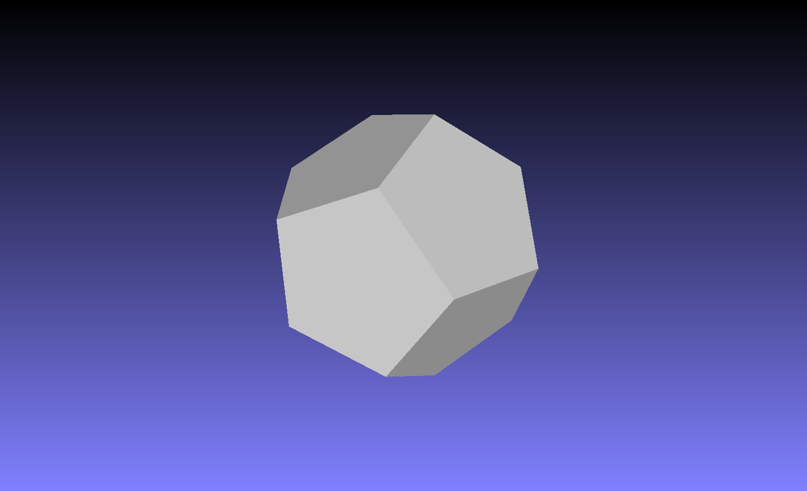
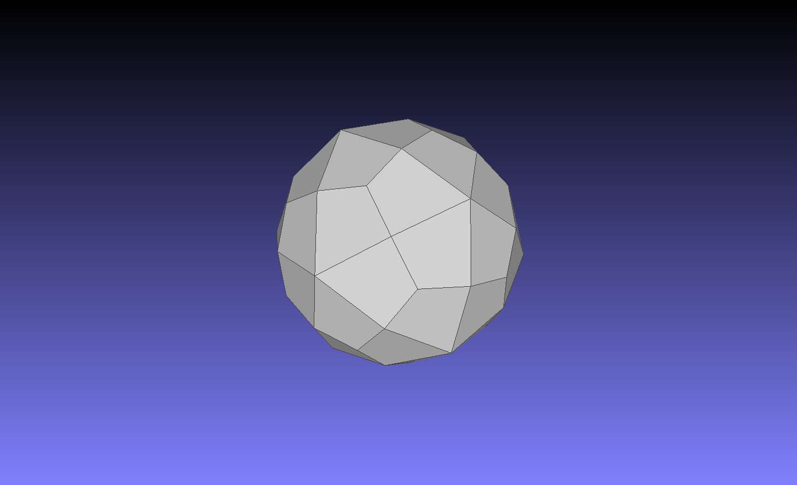
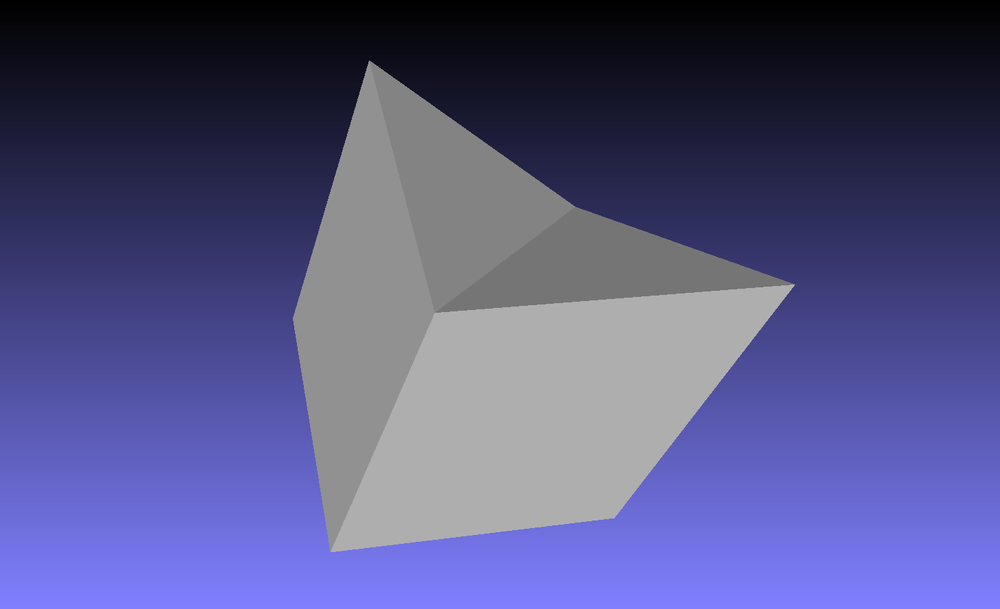
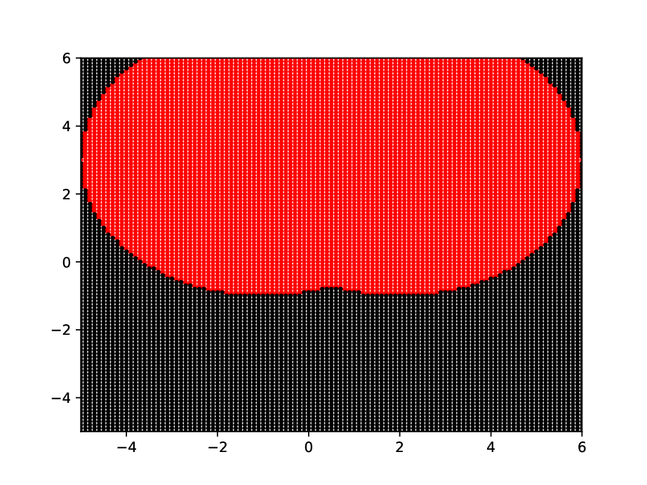
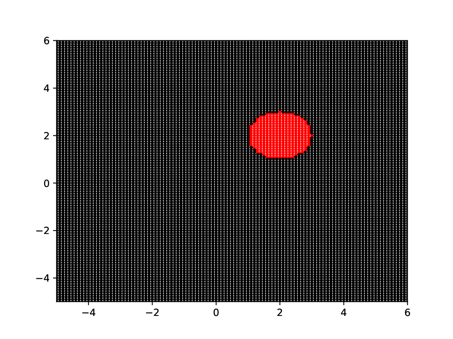
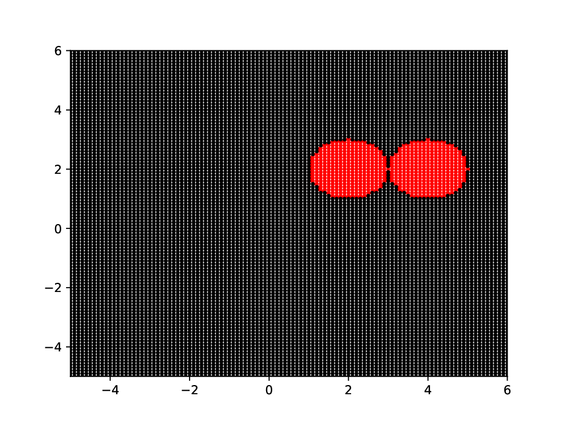
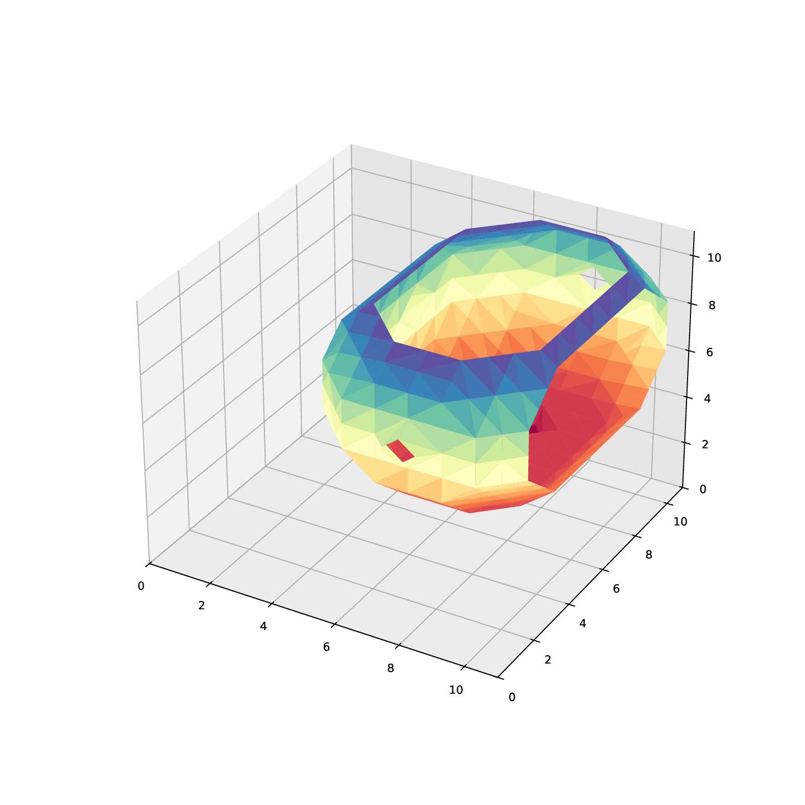
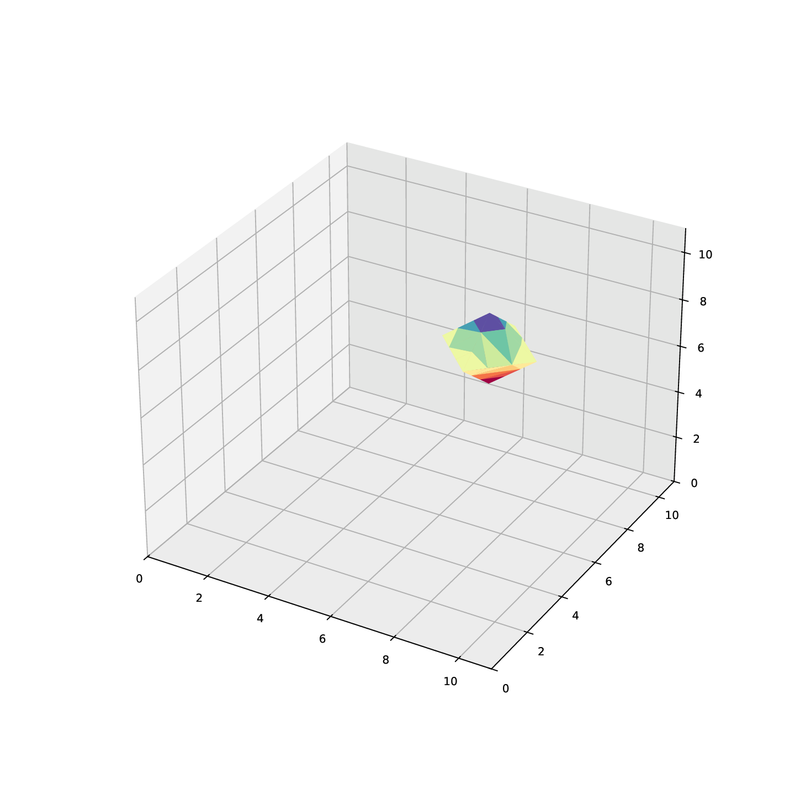
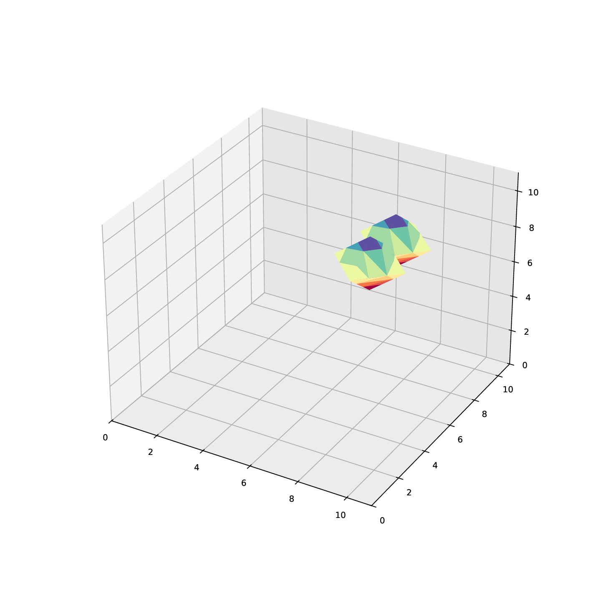

# Algorithms of Catmull-Clark and Loop

## 8. Catmull-Clark ✅

### Prototype

```python
catmull_clark(input_file, number_of_iterations, output_file)
```

### Test cases

Test case 1:

```python
catmull_clark("./meshes/dodecahedron.off", 1, "./meshes/dodecahedron_prime.off")
```



Test case 2:

```python
catmull_clark("./meshes/cube4.off", 3, "./meshes/cube4_prime.off")
```




## 9. Loop

### Prototype

```python
loop(input_file, number_of_iterations, output_file)
```

# Drawing implicit surfaces: Marching Squares and Marching Cubes

## 10. Marching squares ✅

### Prototype

```python
marching_squares(
    json_object_describing_curve, 
    output_filename, 
    x_min, y_min, x_max, y_max, 
    precision
)
```

Test case 1:

```python
example_json = {
    "op": "union",
    "function": "",
    "childs": [
        {
            "op": "",
            "function": "(x-2)^2 + (y-3)^2 - 4^2",
            "childs": []
        },
        {
            "op": "",
            "function": "(x+1)^2 + (y-3)^2 - 4^2",
            "childs": []
        },
    ]
}

marching_squares(
    example_json,
    'example-marching-squares-1.eps',
    -5, -5, 6, 6,
    0.1
)
```



Test case 2:

```python
marching_squares(
    # one circle of radius 1 centered at (2, 2)
    {"op":"", "function":"(x-2)^2+(y-2)^2-1", "childs":[]},
    'example-marching-squares-2.eps',
    -5, -5, 6, 6,
    0.1
)
```



Test case 3:

```python
marching_squares(
    {"op":"union", "function":"","childs":[
    # circles of radius 1 centered at (2, 2) and (4, 2)
{"op":"", "function":"(x-2)^2+(y-2)^2-1", "childs":[]},
{"op":"", "function":"(x-4)^2+(y-2)^2-1", "childs":[]}]},
'example-marching-squares-3.eps',
-5, -5, 6, 6,
0.1)
```




## 11. Marching cubes ✅

### Prototype

```python
marching_cubes(
    json_object_describing_surface,
    output_filename,
    x_min, y_min, x_max, y_max, z_min, z_max,
    precision
)
```

### Test cases

Test case 1:

```python

example_json = {
  "op": "union",
  "function": "",
  "childs": [
    {
      "op": "",
      "function": "(x-2)^2 + (y-3)^2 + (z-3)^2 - 4^2",
      "childs": []
    },
    {
      "op": "",
      "function": "(x+1)^2 + (y-3)^2 + (z-3)^2 - 4^2",
      "childs": []
    }
  ]
}
# example_json = lambda x, y, z : np.logical_or.reduce([
#     (x-2)**2 + (y-3)**2 + (z-3)**2 - 4**2 <= 0, 
#     (x+1)**2 + (y-3)**2 + (z-3)**2 - 4**2 <= 0
# ])

marching_cubes(
    example_json,
    'example-marching-cubes-1.eps',
    -5, -5, -5, 6, 6, 6,
    0.1
)
```




Test case 2:

```python
marching_cubes(
# sphere of radius 1 centered at (2, 2, 2)
{"op":"", "function":"(x-2)^2+(y-2)^2+(z-2)^2-1", "childs":[]},
'example-marching-cubes-2.eps',
-5, -5, -5, 6, 6, 6,
0.1)
```



Test case 3:

```python
marching_cubes(
{"op":"union", "function":"", "childs":[
{"op":"", "function":"(x-2)^2+(y-2)^2+(z-2)^2-1", "childs":[]},
{"op":"", "function":"(x-4)^2+(y-2)^2+(z-2)^2-1", "childs":[]}
]},
'example-marching-cubes-3.eps',
-5, -5, -5, 6, 6, 6,
0.1)
```




# Drawing 3D meshes in 2D


## References

[OpenAI ChatGPT](https://chatgpt.com/share/67cbb080-0360-800b-8147-8dc44f3f7e70)


