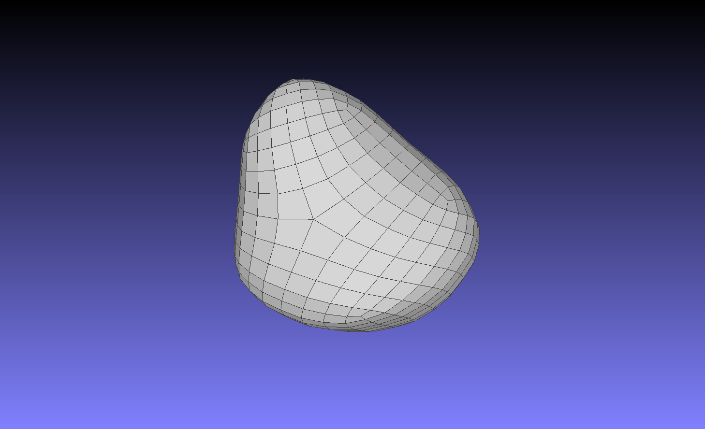

# Algorithms of Catmull-Clark and Loop

## 8. Catmull-Clark

### Prototype

```python
catmull_clark(input_file, number_of_iterations, output_file)
```

### Test cases

Test case 1:

```python
catmull_clark("./meshes/dodecahedron.off", 1, "./meshes/dodecahedron_prime.off")
```


Test case 2:

```python
catmull_clark("./meshes/cube4.off", 3, "./meshes/cube4_prime.off")
```




## 9. Loop

### Prototype

```python
loop(input_file, number_of_iterations, output_file)
```


## References

[OpenAI ChatGPT](https://chatgpt.com/share/67cbb080-0360-800b-8147-8dc44f3f7e70)


