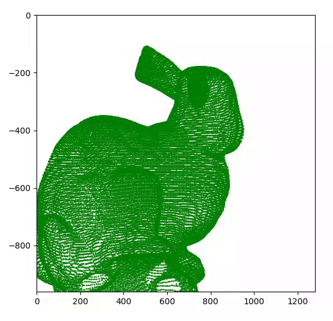

# Computer Graphics PC4

## Camera model

### 1. Project a cloud of points ✅

### 2. Generate an animation ✅

## Augmented reality

### 3. Simple example of augmented reality ✅

## Image Stitching

### 4. Simple example of image stitching ✅

## Image recognition

### 5. Using YOLO ✅

